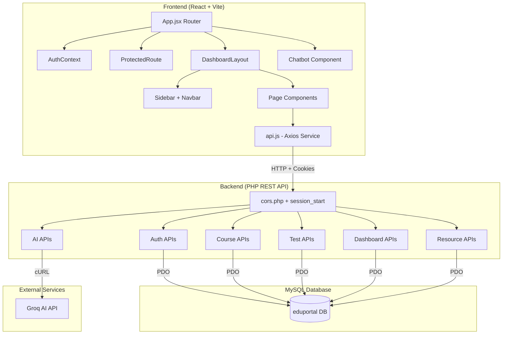
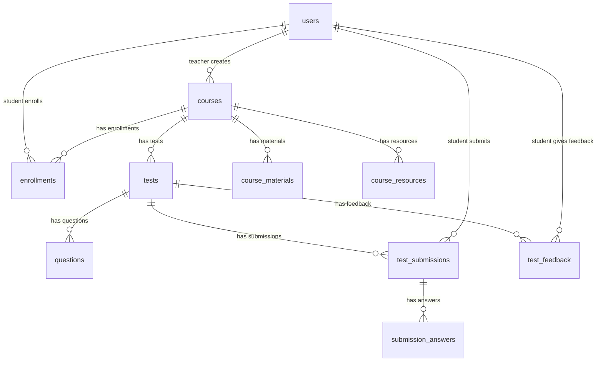
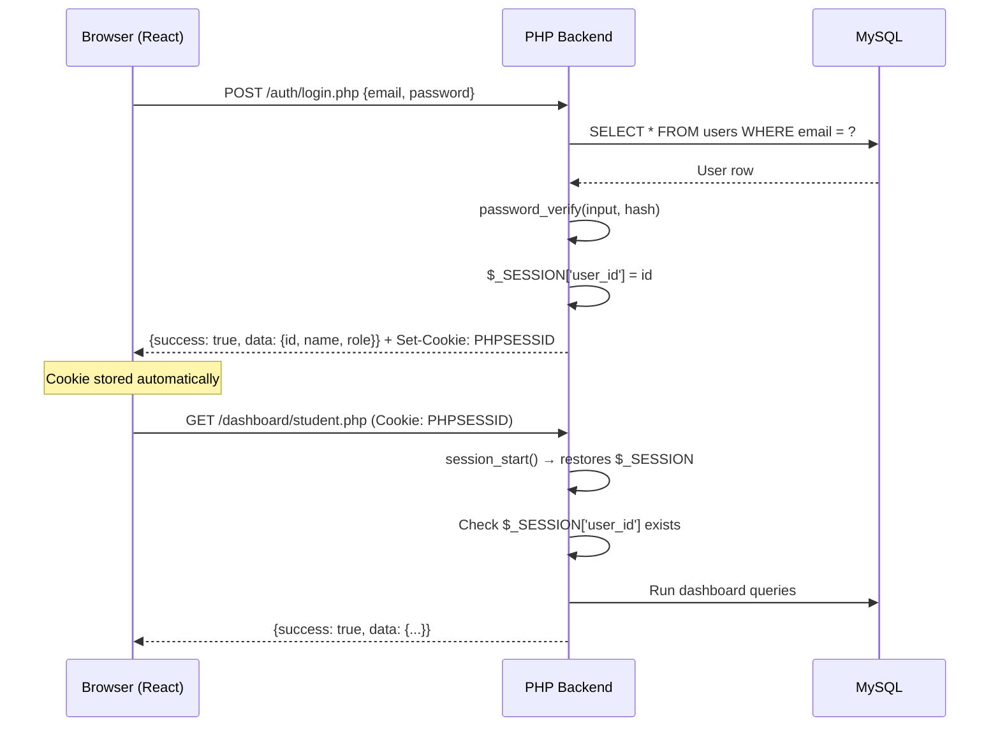

# EduPortal — Complete Full-Stack Project Study Guide

> **Stack:** React + Vite (Frontend) | PHP (Backend) | MySQL (Database) | XAMPP | Groq AI (LLM)
> **Purpose:** Web Technology Course Submission + Full-Stack Interview Prep

---

## 1. Project Vision & What We Built

EduPortal is a **Student Management System** (LMS) that allows:
- **Teachers** to create courses, upload resources, build tests (manually or with AI), and view analytics
- **Students** to browse/enroll in courses, take tests, view results, get AI-powered study recommendations, and chat with an AI tutor

### Key Features Built
| Feature | Student | Teacher |
|---|---|---|
| Authentication | ✅ Register/Login | ✅ Register/Login |
| Dashboard | Stats, Courses, Performance Chart, AI Recommendations | Stats, Enrollment Chart, Score Chart, Recent Submissions |
| Courses | Browse Catalog, Enroll/Unenroll, View Resources | Create (3-step wizard), Publish/Unpublish, Manage |
| Resources | View documents, Inline video player | Upload files (PDF, DOC, MP4, etc.) |
| Tests | Take tests (timed), View results, Submit feedback | Build tests (manual + AI quiz gen), Publish |
| AI Chatbot | Interactive EduBot for Q&A | — |
| AI Quiz Generator | — | Auto-generate MCQs from topic |
| AI Recommendations | Personalized study advice on Dashboard | — |
| Results | My Results page (stats, search, filter) | Test Analytics with student feedback |

---

## 2. Architecture Overview



### How Data Flows (Example: Student Takes Test)
```
1. Student clicks "Start Test" → TakeTest.jsx renders
2. Component calls getTest(id) → axios GET /tests/show.php?id=X
3. PHP checks session, queries MySQL, returns questions JSON
4. Student answers questions, clicks Submit
5. Component calls submitTest(data) → axios POST /tests/submit.php
6. PHP auto-grades MCQs, calculates score, stores in test_submissions + submission_answers
7. Frontend redirects to TestResult.jsx → calls getMyTestResult(id)
8. Result page shows score donut chart, answer review, feedback form
```

---

## 3. Database Schema (10 Tables)



### Key Design Decisions
| Decision | Why |
|---|---|
| `password_hash VARCHAR(255)` | PHP's `password_hash()` outputs ~60 chars, but 255 is future-proof |
| `UNIQUE KEY unique_enrollment` | Prevents duplicate enrollments |
| `UNIQUE KEY one_attempt` | One submission per student per test |
| `options_json JSON` | Flexible MCQ options stored as JSON array |
| `is_published TINYINT(1)` | Draft/published toggle for courses and tests |
| `FOREIGN KEY ... ON DELETE CASCADE` | Deleting a course auto-cleans enrollments, tests, etc. |

---

## 4. Backend API Reference (PHP)

### Architecture Pattern
Every PHP endpoint follows this exact pattern:

```php
<?php
session_start();                    // 1. Start session
require_once '../config/cors.php';  // 2. Handle CORS + OPTIONS preflight
require_once '../config/db.php';    // 3. Get PDO connection

// 4. Method check
if ($_SERVER['REQUEST_METHOD'] !== 'POST') {
    http_response_code(405);
    echo json_encode(['success' => false, 'message' => 'Method not allowed']);
    exit();
}

// 5. Auth check
if (!isset($_SESSION['user_id'])) {
    http_response_code(401);
    echo json_encode(['success' => false, 'message' => 'Not authenticated']);
    exit();
}

// 6. Role check (if needed)
if ($_SESSION['role'] !== 'teacher') {
    http_response_code(403);
    echo json_encode(['success' => false, 'message' => 'Forbidden']);
    exit();
}

// 7. Input parsing
$input = json_decode(file_get_contents('php://input'), true);

// 8. Validation → 9. DB query → 10. JSON response
```

### CORS Configuration (`config/cors.php`)
```php
header("Access-Control-Allow-Origin: http://localhost:5173"); // Vite dev server
header("Access-Control-Allow-Credentials: true");             // Allow cookies/sessions
header("Access-Control-Allow-Methods: GET, POST, PUT, DELETE, OPTIONS");
header("Access-Control-Allow-Headers: Content-Type, Authorization");
header("Content-Type: application/json");
if ($_SERVER['REQUEST_METHOD'] === 'OPTIONS') { http_response_code(200); exit(); }
```

> **Interview Tip:** The `OPTIONS` preflight is sent by browsers before cross-origin requests with custom headers. Without handling it, CORS fails silently.

### Full API Endpoint Map

| Method | Endpoint | Auth | Role | Purpose |
|--------|----------|------|------|---------|
| POST | `/auth/register.php` | — | — | Create account |
| POST | `/auth/login.php` | — | — | Login (sets session) |
| POST | `/auth/logout.php` | ✅ | — | Destroy session |
| GET | `/auth/me.php` | ✅ | — | Get current user |
| GET | `/courses/index.php` | ✅ | — | List published courses |
| POST | `/courses/create.php` | ✅ | Teacher | Create course |
| GET | `/courses/show.php?id=X` | ✅ | — | Get single course |
| PUT | `/courses/update.php` | ✅ | Teacher | Update course |
| DELETE | `/courses/delete.php?id=X` | ✅ | Teacher | Delete course |
| GET | `/courses/my.php` | ✅ | Teacher | Teacher's own courses |
| POST | `/enrollments/enroll.php` | ✅ | Student | Enroll in course |
| DELETE | `/enrollments/unenroll.php` | ✅ | Student | Unenroll |
| GET | `/enrollments/my.php` | ✅ | Student | My enrollments |
| POST | `/resources/upload.php` | ✅ | Teacher | Upload file resource |
| GET | `/resources/course.php?course_id=X` | ✅ | — | Get course resources |
| DELETE | `/resources/delete.php?id=X` | ✅ | Teacher | Delete resource |
| POST | `/tests/create.php` | ✅ | Teacher | Create test + questions |
| GET | `/tests/show.php?id=X` | ✅ | — | Get test with questions |
| GET | `/tests/course.php?course_id=X` | ✅ | — | Tests for a course |
| POST | `/tests/publish.php` | ✅ | Teacher | Publish test |
| POST | `/tests/submit.php` | ✅ | Student | Submit test answers |
| GET | `/tests/my_result.php?test_id=X` | ✅ | Student | Single test result |
| GET | `/tests/my_all_results.php` | ✅ | Student | All my results |
| GET | `/tests/all_results.php?test_id=X` | ✅ | Teacher | All student results |
| POST | `/tests/feedback.php` | ✅ | Student | Submit feedback |
| GET | `/tests/feedback.php?test_id=X` | ✅ | Teacher | View feedback |
| GET | `/dashboard/student.php` | ✅ | Student | Dashboard aggregation |
| GET | `/dashboard/teacher.php` | ✅ | Teacher | Dashboard aggregation |
| POST | `/ai/chat.php` | ✅ | Student | Chat with EduBot |
| POST | `/ai/generate_quiz.php` | ✅ | Teacher | AI quiz generation |
| GET | `/ai/recommendations.php` | ✅ | Student | AI study recommendations |

---

## 5. Frontend Architecture (React)

### Component Tree
```
App.jsx
├── AuthProvider (Context)
├── Router
│   ├── /login → Login.jsx
│   ├── /register → Register.jsx
│   └── ProtectedRoute
│       └── DashboardLayout
│           ├── Sidebar.jsx
│           ├── Navbar.jsx
│           └── <Outlet /> (nested routes)
│               ├── Student Routes
│               │   ├── Dashboard.jsx (+ RecommendationsWidget)
│               │   ├── CourseCatalog.jsx
│               │   ├── CourseDetail.jsx (+ VideoPlayerModal)
│               │   ├── TakeTest.jsx
│               │   ├── TestResult.jsx (+ FeedbackForm)
│               │   └── MyResults.jsx
│               └── Teacher Routes
│                   ├── Dashboard.jsx
│                   ├── CourseManager.jsx (+ CreateCourseModal)
│                   ├── CourseResources.jsx
│                   ├── TestBuilder.jsx (+ AI GenerateModal)
│                   └── Analytics.jsx
└── Chatbot.jsx (floating, global)
```

### Key React Patterns Used

#### 1. Context API for Auth
```jsx
// AuthContext.jsx — Global auth state
const AuthContext = createContext();
export const useAuth = () => useContext(AuthContext);

// Provides: { user, login, logout, loading }
// On mount: calls getMe() to restore session from cookie
```

> **Interview Tip:** We use Context instead of Redux because auth is the only global state. For a larger app, consider Zustand or Redux Toolkit.

#### 2. Protected Routes
```jsx
const ProtectedRoute = ({ allowedRoles, children }) => {
    const { user } = useAuth();
    if (!user) return <Navigate to="/login" />;
    if (!allowedRoles.includes(user.role)) return <Navigate to="/login" />;
    return children;
};
```

#### 3. Axios Service Layer (`api.js`)
```jsx
const api = axios.create({
    baseURL: 'http://localhost/eduportal/api',
    withCredentials: true,  // CRITICAL: sends session cookies cross-origin
});

// Each export = one API call
export const getCourses = () => api.get('/courses/index.php');
export const createCourse = (data) => api.post('/courses/create.php', data);
```

> **Interview Tip:** `withCredentials: true` is essential. Without it, the PHP session cookie won't be sent from `localhost:5173` (Vite) to `localhost:80` (Apache), and every request appears unauthenticated.

#### 4. Dashboard Layout Pattern
```jsx
const DashboardLayout = () => {
    const [sidebarOpen, setSidebarOpen] = useState(false);
    return (
        <div className="flex h-screen">
            <Sidebar isOpen={sidebarOpen} setIsOpen={setSidebarOpen} />
            <div className="flex-1 flex flex-col overflow-hidden">
                <Navbar toggleSidebar={() => setSidebarOpen(!sidebarOpen)} />
                <main className="flex-1 overflow-y-auto p-6">
                    <Outlet />  {/* Nested routes render here */}
                </main>
            </div>
        </div>
    );
};
```

---

## 6. AI Integration — How It Works

### Architecture
```
Frontend → PHP Backend → Groq API (OpenAI-compatible) → Response → Frontend
```

### Config (`config/ai.php`)
```php
define('GROQ_API_KEY', 'gsk_...');
define('GROQ_API_URL', 'https://api.groq.com/openai/v1/chat/completions');
define('GROQ_MODEL', 'llama-3.3-70b-versatile');

function callGeminiAPI($prompt) {
    // Uses OpenAI chat completions format:
    // { model, messages: [{role, content}], temperature, max_tokens }
    // Auth: Bearer token in header
    // Includes retry logic for 429/503 errors
}
```

### Three AI Features

#### Feature 1: EduBot Chatbot
```
chat.php builds a messages array:
1. System message: "You are EduBot, an AI learning assistant..."
2. History: Previous messages mapped (bot→assistant, user→user)
3. Current message from student

→ Sent to Groq API
→ Response: choices[0].message.content
→ Returned as { success: true, reply: "..." }
```

#### Feature 2: AI Quiz Generator
```
generate_quiz.php builds a prompt:
"Generate N MCQ questions about [topic].
 Return ONLY raw JSON array: [{question_text, question_type, marks, options_json}]"

→ Sent to Groq API
→ Response parsed from markdown-wrapped JSON
→ Questions injected into TestBuilder state
```

#### Feature 3: Personalized Recommendations
```
recommendations.php:
1. Fetches student's enrolled courses from DB
2. Fetches last 10 test scores from DB
3. Builds prompt: "Based on courses [X, Y] and scores [A%, B%], give 3 study tips"
→ Response displayed in Dashboard widget
```

> **Interview Tip:** We proxy AI calls through PHP (not directly from the browser) because API keys must never be exposed in client-side JavaScript. The backend acts as a secure intermediary.

---

## 7. Authentication Flow



### Security Measures
- **Passwords:** `password_hash()` with bcrypt (auto-salted)
- **Sessions:** PHP native sessions with `PHPSESSID` cookie
- **CORS:** Locked to `http://localhost:5173` only
- **Role checks:** Every endpoint verifies `$_SESSION['role']`
- **SQL injection:** All queries use PDO prepared statements (`?` placeholders)

---

## 8. Key UI/UX Patterns

### Design System
- **Colors:** Blue (student) / Purple (teacher) theming via conditional classes
- **Typography:** System fonts with Tailwind-style utilities
- **Cards:** `bg-white rounded-xl shadow-sm border border-slate-200`
- **Gradients:** Stat cards use `bg-gradient-to-br from-X-500 to-Y-600`
- **Animations:** `animate-spin` (loading), `animate-bounce` (chatbot), `animate-pulse` (due soon badges)

### Responsive Layout
- Sidebar: Fixed on desktop (`lg:static`), overlay slide-in on mobile
- Grid: `grid-cols-1 md:grid-cols-2 lg:grid-cols-4` for stats
- Tables: `overflow-x-auto` wrapper for horizontal scroll on mobile

### Notable UI Components
| Component | Pattern |
|---|---|
| Score Donut Chart | SVG `strokeDasharray` trick: `dasharray="${percentage}, 100"` |
| Star Rating | Interactive `FiStar` icons with `fill-amber-400` on selected |
| Course Create Wizard | 3-step modal with progress indicators |
| Video Player | Full-screen modal with native `<video controls>` |
| Chatbot | Floating button → expandable panel with minimize/close |

---

## 9. Deployment & DevOps

### Local Development Setup
```bash
# Prerequisites: XAMPP installed with Apache + MySQL

# 1. Clone project
git clone <repo> student-management-system

# 2. Setup database
# Open phpMyAdmin → Import backend/database/schema.sql

# 3. Sync PHP to XAMPP
xcopy "backend\api" "C:\xampp\htdocs\eduportal\api\" /E /I /Y

# 4. Install frontend dependencies
cd frontend
npm install

# 5. Start development
npm run dev  # → http://localhost:5173
# Apache already running on http://localhost (XAMPP)
```

### Critical Gotcha: File Sync
Your project lives at:
```
C:\Users\User\Desktop\Projects\student-management-system\backend\api\  ← SOURCE
C:\xampp\htdocs\eduportal\api\                                          ← SERVED
```
**Every time you edit a PHP file, you MUST sync it to XAMPP!**
```bash
xcopy "backend\api" "C:\xampp\htdocs\eduportal\api\" /E /I /Y
```

### Environment Differences
| Aspect | Development | Production |
|---|---|---|
| Frontend URL | `http://localhost:5173` | `https://yourdomain.com` |
| Backend URL | `http://localhost/eduportal/api` | `https://yourdomain.com/api` |
| CORS Origin | `http://localhost:5173` | Your domain |
| SSL Verify | `CURLOPT_SSL_VERIFYPEER = false` | `true` |
| API Keys | In `config/ai.php` | Environment variables |

---

## 10. Common Interview Questions About This Project

### Q1: "Why PHP + React instead of Node.js + React?"
> This was a Web Technology course project. PHP demonstrates understanding of server-side sessions, Apache configuration, and traditional web architecture. The architecture is the same REST pattern used with Node/Express — just different syntax.

### Q2: "How do you handle authentication?"
> Server-side PHP sessions. On login, `password_verify()` checks the bcrypt hash, then we set `$_SESSION['user_id']` and `$_SESSION['role']`. The session ID is stored in a `PHPSESSID` cookie sent with every subsequent request via `withCredentials: true` in Axios.

### Q3: "Why proxy AI calls through the backend?"
> API keys must never be exposed in client-side code. The browser sends a request to our PHP backend, which then makes a cURL request to Groq with the API key in a server-side header. This also lets us add rate limiting, logging, and retry logic.

### Q4: "How does auto-grading work?"
> `submit.php` loops through student answers. For MCQs, it decodes `options_json` and checks if the selected option has `is_correct: true`. For true/false, it compares strings. It calculates `score / max_score * 100` and stores everything in `test_submissions` and `submission_answers`.

### Q5: "How would you scale this?"
> 1. Replace PHP sessions with JWT tokens for stateless auth
> 2. Move to a cloud database (PlanetScale, AWS RDS)
> 3. Use a job queue (Redis) for AI calls instead of synchronous cURL
> 4. Add caching (Redis) for dashboard aggregation queries
> 5. Deploy frontend to Vercel, backend to a VPS with Nginx

### Q6: "What's the hardest bug you faced?"
> The AI chatbot showed "Network error" but everything looked correct. Through systematic debugging, I discovered that PHP files were being edited in the project directory but Apache was serving from a completely different XAMPP directory. The `ai/` folder didn't exist at the served path at all. The fix was establishing a sync workflow between the project and XAMPP.

---

## 11. File-by-File Reference

### Backend (`backend/api/`)
```
config/
  ai.php          → Groq API key, URL, model, callGeminiAPI() helper
  cors.php        → CORS headers + OPTIONS preflight handler
  db.php          → PDO MySQL connection

auth/
  register.php    → POST: Create user with password_hash()
  login.php       → POST: Verify password, start session
  logout.php      → POST: session_destroy()
  me.php          → GET: Return current user from session

courses/
  index.php       → GET: All published courses (for catalog)
  create.php      → POST: Teacher creates course
  show.php        → GET: Single course detail
  update.php      → PUT: Update course (publish toggle)
  delete.php      → DELETE: Remove course
  my.php          → GET: Teacher's own courses
  students.php    → GET: Students enrolled in a course

enrollments/
  enroll.php      → POST: Student enrolls
  unenroll.php    → DELETE: Student unenrolls
  my.php          → GET: Student's enrollments

resources/
  upload.php      → POST: Multipart file upload
  course.php      → GET: Resources for a course
  delete.php      → DELETE: Remove resource

tests/
  create.php      → POST: Create test + questions
  show.php        → GET: Test with questions
  course.php      → GET: Tests for a course
  publish.php     → POST: Publish test
  submit.php      → POST: Submit & auto-grade
  my_result.php   → GET: Student's single result
  my_all_results.php → GET: Student's all results
  all_results.php → GET: Teacher views all submissions
  feedback.php    → POST/GET: Submit/view feedback
  delete.php      → DELETE: Remove test

dashboard/
  student.php     → GET: Aggregated stats, courses, tests, activity
  teacher.php     → GET: Aggregated stats, charts, submissions

ai/
  chat.php        → POST: Multi-turn conversation with Groq
  generate_quiz.php → POST: AI generates MCQ questions
  recommendations.php → GET: AI study recommendations
```

### Frontend (`frontend/src/`)
```
main.jsx          → ReactDOM.render entry point
App.jsx           → Router + DashboardLayout + all routes
App.css           → Global styles
index.css         → Tailwind/reset styles

context/
  AuthContext.jsx → Auth state management (user, login, logout)

services/
  api.js          → Axios instance + all API function exports

components/
  Navbar.jsx      → Top navigation bar with user info + logout
  Sidebar.jsx     → Navigation links (student vs teacher)
  ProtectedRoute.jsx → Route guard by role
  Chatbot.jsx     → Floating AI chat widget

pages/auth/
  Login.jsx       → Login form with validation
  Register.jsx    → Registration form (student/teacher toggle)

pages/student/
  Dashboard.jsx   → Stats, courses, charts, AI recommendations widget
  CourseCatalog.jsx → Browse & enroll in courses
  CourseDetail.jsx → Course overview, resources (video player), tests
  TakeTest.jsx    → Full-screen test-taking with timer
  TestResult.jsx  → Score donut, answer review, feedback form
  MyResults.jsx   → All results with stats, search, filter

pages/teacher/
  Dashboard.jsx   → Stats, enrollment chart, performance chart, submissions
  CourseManager.jsx → CRUD courses with 3-step wizard modal
  CourseResources.jsx → Upload & manage course files
  TestBuilder.jsx → Build tests manually + AI quiz generation
  Analytics.jsx   → View student feedback per test
```

---

## 12. npm Dependencies

```json
{
  "dependencies": {
    "axios": "^1.x",           // HTTP client for API calls
    "react": "^18.x",          // UI framework
    "react-dom": "^18.x",
    "react-router-dom": "^6.x", // Client-side routing
    "react-hot-toast": "^2.x",  // Toast notifications
    "react-icons": "^4.x",      // Icon library (Feather icons)
    "react-markdown": "^9.x",   // Render markdown in chatbot
    "recharts": "^2.x"          // Charts (Line, Bar)
  }
}
```

---

> **Final Note:** This project demonstrates a complete full-stack workflow: database design → REST API development → frontend component architecture → third-party API integration → debugging production issues → deployment. Every pattern here (CORS, sessions, protected routes, service layers, context API) is directly applicable to real-world projects and interviews.
